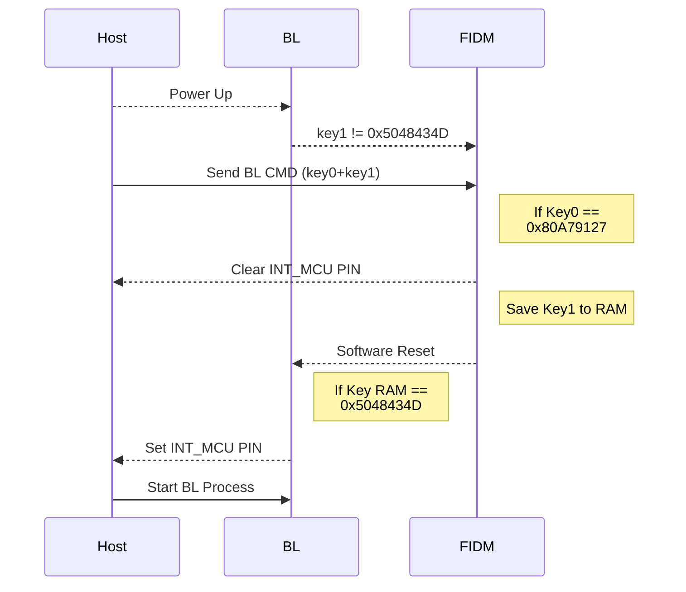

### Info4 Application Bootloader Sequence

```mermaid
sequenceDiagram
Host-->> BL: Power Up
BL -->> FIDM: key1 != 0x5048434D
Host ->> FIDM: Send BL CMD (key0+key1)
Note right of FIDM: If Key0 == <BR>0x80A79127
FIDM-->> Host: Clear INT_MCU PIN
Note right of FIDM: Save Key1 to RAM
FIDM-->> BL: Software Reset
Note right of BL: If Key RAM == <BR>0x5048434D
BL -->> Host: Set INT_MCU PIN
Host ->> BL: Start BL Process
```